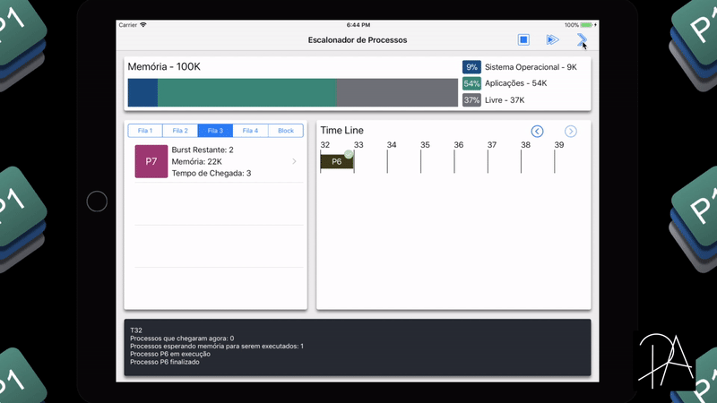
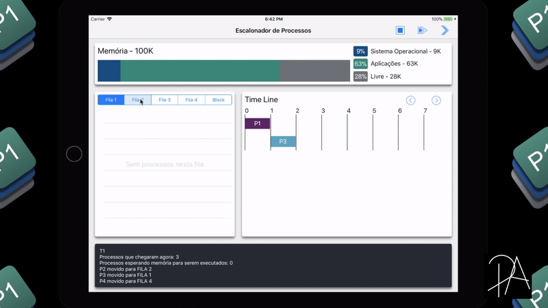
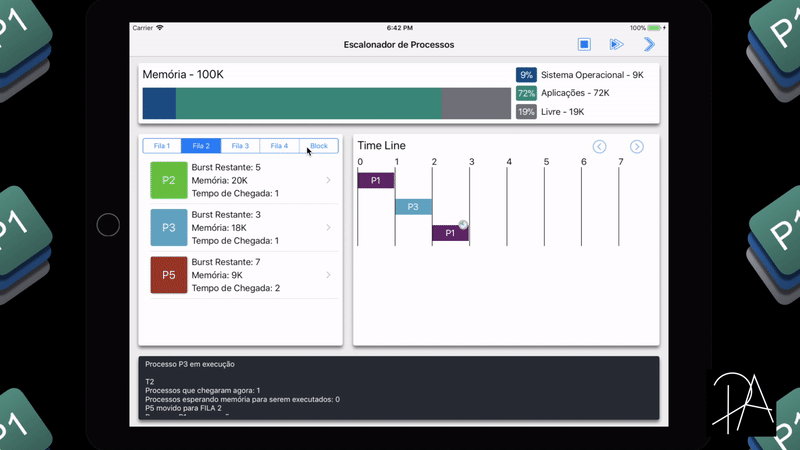
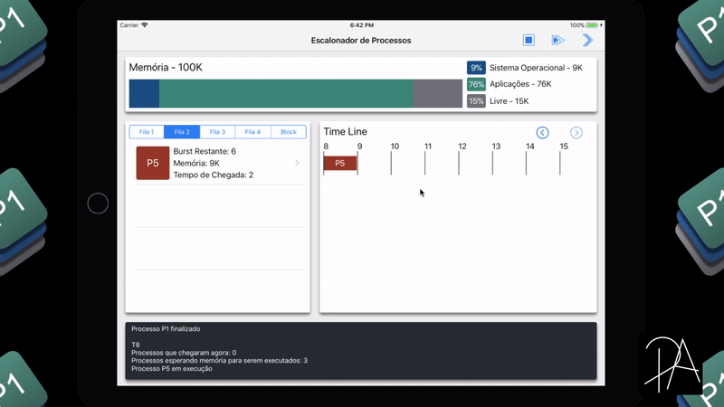
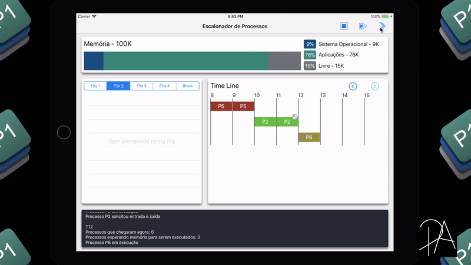
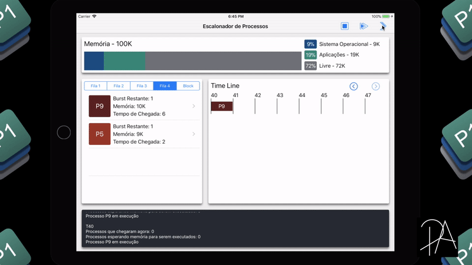
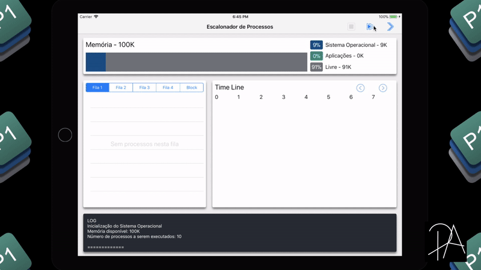
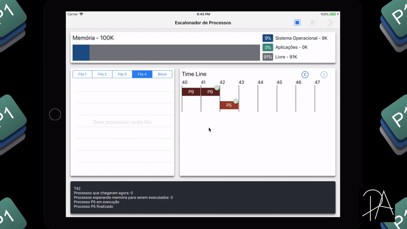

# Escalonador de Processos - iOS
Simulador de um escalonador de processos desenvolvido para plataforma iOS (iPad), `Swift 4`, para a disciplina de Sistemas Operacionais.

******

## Ideia Geral
O escalonador receberá 10 diferentes processos, então organizará estes em 4 filas de acordo com as prioridades já definidas pelos processos. A partir do Algoritmo Round Robin com multiplas filas de prioridade, o escalonador executará os processos respeitando o tempo de quantum de cada fila.
Há possibilidade dos processos pedirem um tempo ao processador para que possam executar uma entrada ou saída (Processos IOBound). Neste caso, pré-definido no código, o tempo em que os processos que fazem essa solicitação ficaram na fila de bloqueados é de 3 unidades de tempo.
Cada processo necessita de um espaço de memória para que seja executado, ou seja, este espaço fica reservado a ele enquanto desde o momento que entra em uma das filas até o momento que é finalizado definitivamente. Pré-definido no código também, a memória total para execuções é de 100K, sendo 9K já reservados para o Sistema Operacional, sendo assim 91K livres para execução.

## Recursos da Interface Gráfica
A aplicação conta com 4 áreas, sendo elas:
Memória, onde mostras as informações referentes a utilização da mesma pelos processos.
Tabelas de Informação, que representam quais processos estão em cada fila, e ao pressionar um processo, abrem-se as informações detalhadas referentes a ele.
Time-Line, que representa as execuções através do tempo.
Log, que mostra detalhadamente tudo que aconteceu em cada instante de tempo.

A execução pode ser acompanhada Setp by Step (Botão com uma seta), ou verificar todo o resultado de uma única vez (Botão de play).

Uma demostração ilustrativa pode ser acompanhada abaixo:

**Memória - Alocação de Memória com Animação**

**Tabelas de Filas**

**Time-Line - Visualização com Gestos**

**Log**

**Extras - Tempo Médio de Espera, Executar Rápidamente, Reiniciar**

## Processos
O escalonador recebe uma lista de 10 processos para serem executados, sendo eles:
* P1
  - Prioridade: 4
  - Chega no instante: 0
  - Memória necessária: 12
  - Tempo de Burst: 3
  - IO: No instante 2
* P2
  - Prioridade: 3
  - Chega no instante: 1
  - Memória necessária: 20
  - Tempo de Burst: 5
  - IO: No instante 4
* P3
  - Prioridade: 4
  - Chega no instante: 1
  - Memória necessária: 18
  - Tempo de Burst: 4
  - IO: No instante -
* P4
  - Prioridade: 1
  - Chega no instante: 1
  - Memória necessária: 13
  - Tempo de Burst: 2
  - IO: No instante -
* P5
  - Prioridade: 3
  - Chega no instante: 2
  - Memória necessária: 9
  - Tempo de Burst: 7
  - IO: No instante -
* P6
  - Prioridade: 4
  - Chega no instante: 3
  - Memória necessária: 31
  - Tempo de Burst: 8
  - IO: No instante 3, 5
* P7
  - Prioridade: 4
  - Chega no instante: 3
  - Memória necessária: 22
  - Tempo de Burst: 5
  - IO: No instante -
* P8
  - Prioridade: 2
  - Chega no instante: 5
  - Memória necessária: 6
  - Tempo de Burst: 4
  - IO: No instante 2
* P9
  - Prioridade: 1
  - Chega no instante: 6
  - Memória necessária: 10
  - Tempo de Burst: 3
  - IO: No instante -
* P10
  - Prioridade: 4
  - Chega no instante: 7
  - Memória necessária: 15
  - Tempo de Burst: 2
  - IO: No instante -

<!-- Nada  -->
